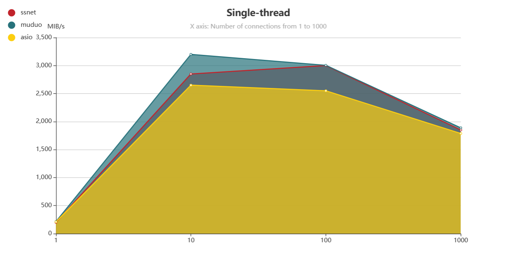
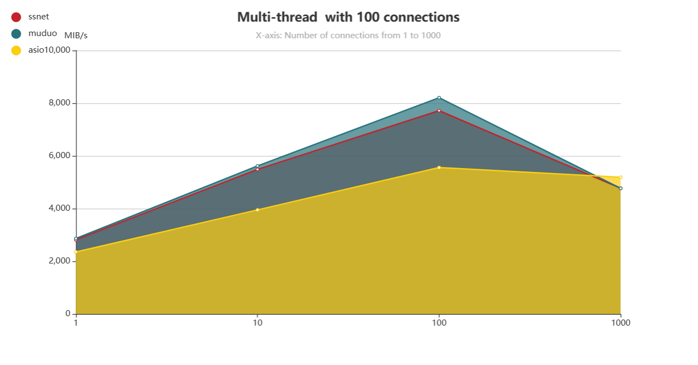
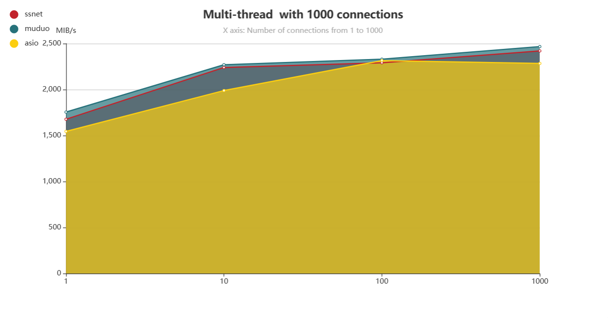

```
  ____    ____    _   _   _____   _____
 / ___|  / ___|  | \ | | | ____| |_   _| 
 \___ \  \___ \  |  \| | |  _|     | |   
  ___) |  ___) | | |\  | | |___    | |   
 |____/  |____/  |_| \_| |_____|   |_|   
 ```
# ssnet

A c++ non-blocking network library for Linux multithreaded servers

## Table of Contents

- [ssnet](#ssnet)
    - [Table of Contents](#table-of-contents)
    - [Getting Started](#getting-started)
        - [Prerequisites](#prerequisites)
        - [Installation](#installation)
    - [Usage](#usage)
    - [Running the Tests](#running-the-tests)
    - [References](#references)

## Getting Started

```bash
sh build.sh

```

### Prerequisites

```
cmake 
```

### Installation

- [ ] xxx

## Usage

- [x] example of echo server

    ```cpp
    class EchoServer {
    public:
        EchoServer(EventLoop* loop, const EndPoint& listenAddr) :
                _loop(loop),
                _svr(loop, listenAddr)
        {
            _svr.setMessageCallback(std::bind(&EchoServer::onMessage, this, _1, _2));
        }
    
        void start() {
            _svr.start();
        }
    
    private:
        void onMessage(const TcpConnectionPtr& conn, Buffer* buf) {
            conn->send(*buf);
        }
    
        EventLoop* _loop;
        TcpServer _svr;
    };
    
    int main() {
        EventLoop loop;
        EndPoint listenAddr(9102);
        EchoServer server(&loop, listenAddr);
        server.start();
        loop.loop();
    }
    ```

- [ ] other...

## Running the Tests

**Benchmark Environment**: 
Ubuntu 18.04.4 LTS

AMD Ryzen 5 5500U CPU @ 2.1GHz (8 core)

1000Mbps

Memory 8GB DDR4 3200


Round after multiple averages:

- Single thread test:



- Multi-thread  with 100 connections



- Multi-thread  with 1000 connections




## References

[chenshuo/muduo](https://github.com/chenshuo/muduo)


